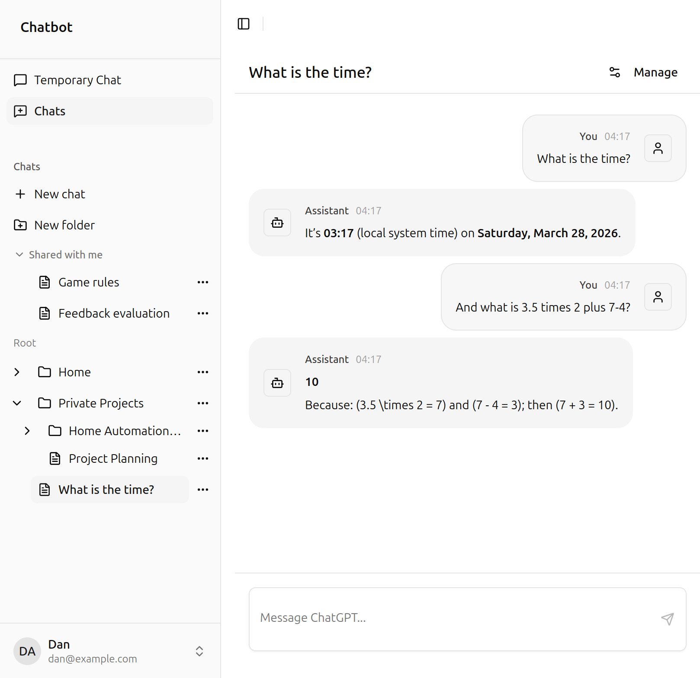
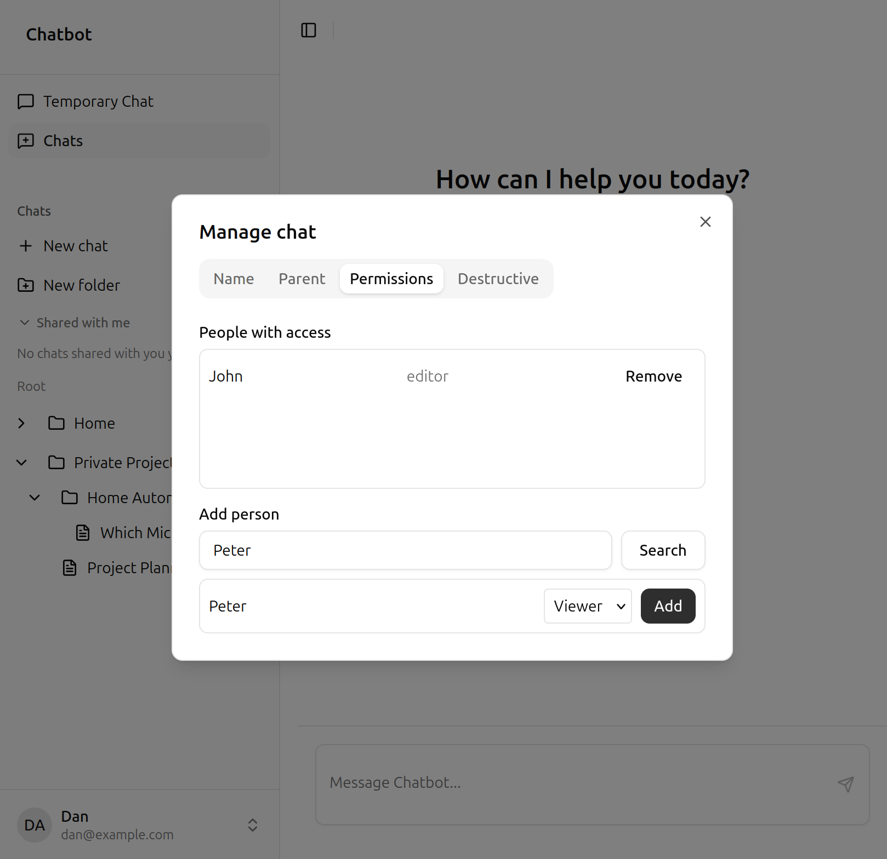

# Smart AI Chatbot

An **evolving** side project built for **experimentation** and for **showcasing** how a modern, full-stack, agentic chatbot can be put together. Nothing here is frozen in stone: APIs, UX, and architecture will shift as ideas are tried out and lessons land.

The goal is a credible playground for **advanced chatbot-building**—multi-turn dialogue, tool use, structured auth and persistence, and a web UI that feels good to use—without pretending to be a finished product.

## What it supports

- Sign up and sign in
- Multi-turn chats with scrollable history
- **Folders**, rename, and move chats between folders
- Assistant can use **tools**
- **Share** a chat with another user as **viewer** or **editor** (owner manages access)

**Tool use in chat**

**Sharing chats**

## Run the full stack (Docker Compose)

- Copy **`.env.compose.example`** → **`.env`** (repo root); set all secrets — see **`python/chatbot-server/src/settings.py`** for `APP_DATA_DATABASE_*` and `AUTHENTICATION_SERVICE_*`
- DB **role passwords** must match your migrations (**`python/chatbot-server/migrations/`**)
- Start: **`./deploy-compose.sh up`** — UI **:8080**, API **:8000**, nginx proxies **`/api`**
- Stop: **`./deploy-compose.sh down`** — stops and removes containers (DB data volume kept)

## Tech used

- **Backend:** Python 3.12+, FastAPI, Pydantic, **uv**, asyncpg, SQL migrations, JWT
- **Agent:** LangGraph, LangChain, OpenAI-compatible APIs
- **Frontend:** React 19, Vite, TypeScript, Tailwind, shadcn/ui, Zustand, TanStack Form, Zod
- **Shape:** Hexagonal ports for auth + app data (swap SQL / mock / Supabase)
- **Quality:** Ruff, pytest, ESLint, Vitest
- **Ship:** Docker images for API + static UI
- **CI — entrypoint:** Repo-root **`ci.sh`** (bash) orchestrates **`python/chatbot-server/ci.sh`** and **`web/chat-ui/ci.sh`**: static checks and production web build by default; **`./ci.sh --build`** forwards **`--build`** so each service runs Docker image build + container smoke tests. From a clone, run it in a terminal at the repo root (`./ci.sh` or `./ci.sh --build`).
- **CI — automation:** **GitHub Actions** (`.github/workflows/ci.yml`) runs **`./ci.sh --build`** on **push** (any branch), on **pull requests** into **`main`**, and on **manual workflow dispatch** — same shell entrypoint as locally, no duplicate pipeline definition.

## Further reading

- [python/chatbot-server/README.md](python/chatbot-server/README.md) — API, env, migrations
- [web/chat-ui/README.md](web/chat-ui/README.md) — dev server, build
